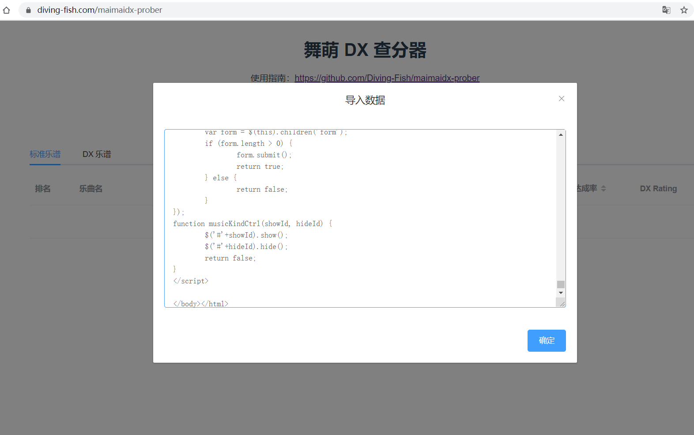

# 舞萌 DX 查分器

本查分器仅用于推分指导用途，不保证歌曲定数、DX Rating、难度 100% 准确。此外，部分歌曲暂无定数数据，如有准确数据欢迎提供。

### 使用指南

使用【电脑版微信】打开 **舞萌DX** 公众号，点击底部【我的记录】，在打开的页面中导航至【记录】-【乐曲成绩】。

在下方乐曲成绩中选择难度后，右击鼠标并点击【获取源代码】（如果右击无效可以往下滑动一些再右击），复制源代码到剪切板中。之后，回到查分器中，点击上方【导入数据】按钮，复制源代码，之后点击确认。

因为每次只能导入一个乐曲难度，所以如果需要导入所有成绩，一共需要进行五次不同难度的导入操作（*其实一般导入上面三个甚至两个难度就OK*），之后乐曲会出现在下方表格中。

### License & Disclaimer

MIT

本查分器与华立、SEGA 等公司无任何关系，注册商标所有权归相关品牌所有。请勿使用本代码用于网络攻击或其他滥用行为。