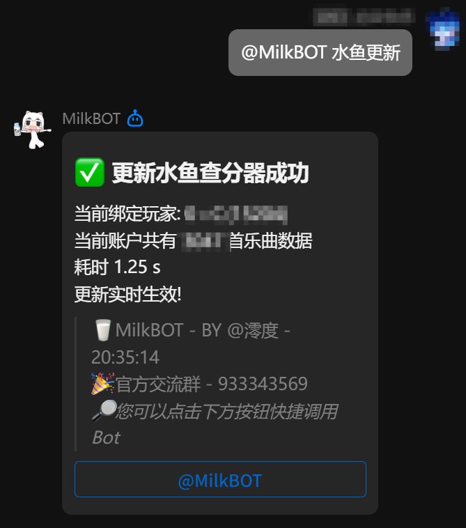

# 使用其他方式上传

您可以直接参考 [API 文档](/docs/developer/zh-api-document) 中的成绩导入接口，自行探索成绩导入方式。

Github 的 [issue 页](https://github.com/Diving-Fish/maimaidx-prober/issues) 也提供了一些成绩导入方式，可以参考。

# 通过MilkBOT进行成绩上传

使用第三方项目 [MilkBOT](https://www.milkbot.cn/start.html) 通过官方数据源进行成绩上传。

您可以添加Bot好友后，使用"更新水鱼"命令进行更新。

> 初次使用需绑定账号，请使用"绑定教程"命令进行绑定。仅需绑定一次后皆可使用相关功能。

